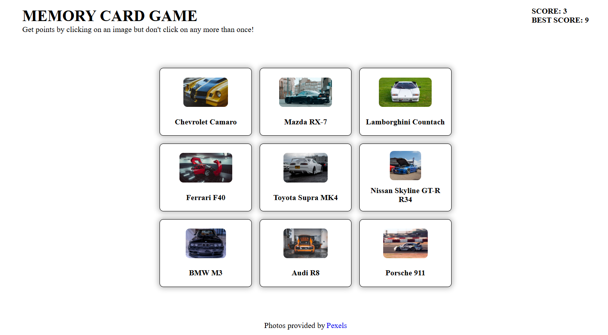

# 🃏 Memory Card Game

A React memory card game where players click on cards without repeating a selection. Card images are fetched live from the Pexels API — one photo per car, searched by name.

Built as part of [The Odin Project](https://www.theodinproject.com/) curriculum.

**[Live Demo](https://topmemorycardsay.netlify.app/)**

## Screenshots


## Features

- 9 cards featuring iconic classic cars, each with a live photo fetched from the Pexels API
- Cards shuffle after every click to make memorisation harder
- Score tracking with current score and best score persisted across rounds
- Win condition when all cards are clicked without repeating
- Game over screen distinguishing between a win and a loss with a restart button
- Loading indicator while images are being fetched
- Keyboard accessible — cards can be activated with Enter or Space

## Tech Stack

- **React 19** + **Vite** — UI and build tooling
- **Pexels API** — live card images fetched by car name
- **CSS** — component-scoped stylesheets
- **ESLint** — linting

## Project Structure

```
src/
├── components/
│   ├── App.jsx       # root component — score state and game flow
│   ├── Grid.jsx      # fetches images, renders card grid, handles click logic
│   ├── Card.jsx      # individual card with image and caption
│   ├── Header.jsx    # displays current and best score + game rules
│   └── GameOver.jsx  # win/lose screen with restart button
├── utils/
│   ├── config.js     # card definitions (car names + generated keys)
│   └── shuffle.js    # Fisher-Yates-style card shuffle
└── styles/           # per-component CSS files
```

## Technical Notes

- Card images are fetched in parallel with `Promise.all` on mount, each queried by car name via the Pexels API
- Score and best score live in `App` and are passed down to `Header`, `Grid`, and `GameOver`
- Cards are initialised with `crypto.randomUUID()` keys in `config.js` to ensure stable identity across shuffles
- Shuffle generates a full permutation of indices before remapping to avoid partial shuffles
- Game over is triggered either by clicking a previously clicked card or by reaching the maximum score

## Getting Started

```bash
git clone https://github.com/Andrii-Sydorchuk/TOP-MemoryCard.git
cd TOP-MemoryCard
npm install
```

Create a `.env` file based on `.env.example` and add your [Pexels API key](https://www.pexels.com/api/):

```bash
cp .env.example .env
```

Run the dev server:

```bash
npm run dev
```

Other scripts:

```bash
npm run build    # production build
npm run preview  # preview the production build
npm run lint     # run ESLint
```

## Acknowledgements

Card images provided by [Pexels](https://www.pexels.com/). Built as a project for [The Odin Project](https://www.theodinproject.com/).
